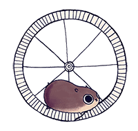

# [mongodb](https://docs.mongodb.com/ecosystem/drivers/node-js/)-cron

> MongoDB collection as crontab

This package offers a simple API for scheduling tasks and running recurring jobs on multiple [MongoDB](https://www.mongodb.org) collections. It uses the officially supported Node.js [driver for MongoDB](https://docs.mongodb.com/ecosystem/drivers/node-js/). It's fast, minimizes processing overhead and it uses atomic commands to ensure safe job executions in cluster environments.



## Setup

```
$ npm install --save mongodb-cron
```

## Quick Start

Below, we create a simple example to show the benefit of using this package in your Node.js projects. To make things as clean as possible, we use [Babel](https://babeljs.io/) with ES7 features thus we can wrap our code into the async block.

```js
(async function() {
  // code that follows
})().catch(console.error);
```

Start by initializing the database connection.

```js
import {MongoClient} from 'mongodb';

let db = await MongoClient.connect('mongodb://localhost:27017/testdb');
let collection = db.collection('events');
```

Continue by initializing and starting the worker.

```js
import {MongoCron} from 'mongodb-cron';

let cron = new MongoCron({
  collection,
  onDocument: async (doc, cron) => console.log(doc),
  onError: async (err, cron) => console.log(err)
});

cron.start(); // start processing
```

We can now create our first job.

```js
let res = await collection.insert({
  name: 'Ricky Martin Show',
  enabled: true
});
```

After inserting the document above to the database, the `onDocument` callback, which we've defined earlier, will immediately be triggered. This is how any collection can become a cron job queue. This is a very basic example so read the next section for advanced features.

## Configuration & Details

We can create a **one-time** or **recurring** jobs. Every time the document processing starts the `startAt` field is updated the the latest date and the `locked` field is set to `true`. When the processing ends the `processedAt` field is set to the current date and the `locked` field is removed.

We can create a one-time job which will start processing immediately just by setting the `enabled` field to `true`.

```js
collection.insert({
  ...
  enabled: true
});
```

Job execution can be delayed by setting the `startAt` field.

```js
collection.insert({
  ...
  startAt: new Date('2016-01-01')
});
```

By setting the `interval` field we define a recurring job.

```js
collection.insert({
  ...
  interval: '* * * * * *' // every second
});
```

The interval above consists of 6 values.

```
*    *    *    *    *    *
┬    ┬    ┬    ┬    ┬    ┬
│    │    │    │    │    |
│    │    │    │    │    └ day of week (0 - 7) (0 or 7 is Sun)
│    │    │    │    └───── month (1 - 12)
│    │    │    └────────── day of month (1 - 31)
│    │    └─────────────── hour (0 - 23)
│    └──────────────────── minute (0 - 59)
└───────────────────────── second (0 - 59)
```

A recurring job will repeat endlessly unless we limit that by setting the `stopAt` field. When a job expires it stops repeating. If we also set `removeExpired` field to `true`, a job is automatically deleted.

```js
collection.insert({
  enabled: true,
  startAt: new Date('2016-01-01'),
  interval: '* * * * * *',
  stopAt: new Date('2020-01-01'),
  removeExpired: true
});
```

Processing speed can be reduced when more and more documents are added into the collection. We can maintain the speed by using indexes.

```js
collection.createIndex({
  enabled: 1,
  locked: 1,
  startAt: 1,
  stopAt: 1
});
```

If 

`MongoCron` class accepts several configuration options.

```js
let cron = new MongoCron({
  // (required) MongoDB collection object.
  collection: db.collection('events'),

  // (default=enabled) The `enabled` field path.
  enabledFieldPath: 'cron.enabled',
  // (default=startAt) The `startAt` field path.
  startAtFieldPath: 'cron.startAt',
  // (default=stopAt) The `stopAt` field path.
  stopAtFieldPath: 'cron.startAt',
  // (default=interval) The `interval` field path.
  intervalFieldPath: 'cron.interval',
  // (default=removeExpired) The `removeExpired` field path.
  removeExpiredFieldPath: 'cron.removeExpired',

  // A method which is triggered when the cron is started.
  onStart: async (cron) => {},
  // A method which is triggered when the cron is stopped.
  onStop: async (cron) => {},
  // A method which is triggered when a document should be processed.
  onDocument: async (doc, cron) => {},
  // A method which is triggered after the cron job has finished processing all 
  // waiting documents.
  onIdle: async (cron) => {},
  // A method which is triggered in case of an error.
  onError: async (err, cron) => {},
  // (default=0) A variable which tells how fast the next job can be processed.
  nextDelay: 1000,
  // (default=0) A variable which tells how many milliseconds the worker should 
  // wait before processing the same job again in case the job is a recurring job.
  reprocessDelay: 1000,
  // (default=0) A variable which tells how many milliseconds the worker should 
  // wait before checking for new jobs after all jobs has been processed.
  idleDelay: 1000
});
```
